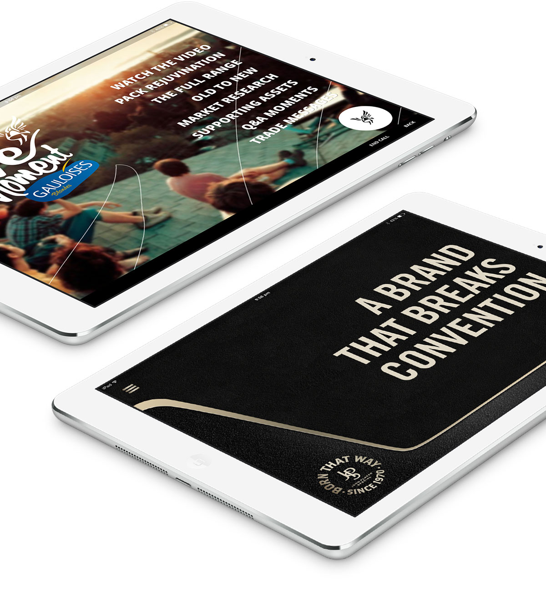

Field InTouch is a versatile, modular platform providing sales forces with a single application for their core needs in the field. It is an iPad app and platform developed by [CLD](http://creativelicence.com.au/), and I regularly produced interactive slidedecks/mini-apps that are housed within in the app while I was there.

Over the time I was at [CLD](http://creativelicence.com.au/), we worked consistently to make these decks more and more impressive, and our clients loved them. Through FiT, they are able to get otherwise unattainable analytics about their field force and the force is able to enjoy their sales material with levels of interactivity and excitement just not achievable by their traditional means and resources.

The majority of the work I did was for our largest client, [Imperial Tobacco](http://www.imperial-tobacco.com/). My work was used all around the world and I localised decks for the U.S, the U.K., Australia, New Zealand, France, Belgium, the Netherlands, Estonia, Saudi Arabia, UAE and Iraq.

## My Approach

While I was generally working with branding dictated by the client/brand, I was able to push the boundaries with the visuals in order to make the decks as fun and exciting for the reps and their audiences.

In these decks, the content is generally the promotion of a new product or feature, so my role was initially to come up with creative concepts for ways to represent this information, including questions with interactive answer mechanics and simple games.

Technically, I was responsible for creating the entire front-end of each deck. I got to have a lot of fun experimenting with cool CSS features and animations, while still being careful to optimise for older generation iPads as well as newer ones. The FiT decks are Brunch apps, utilising Jade, Sass and CoffeeScript.

