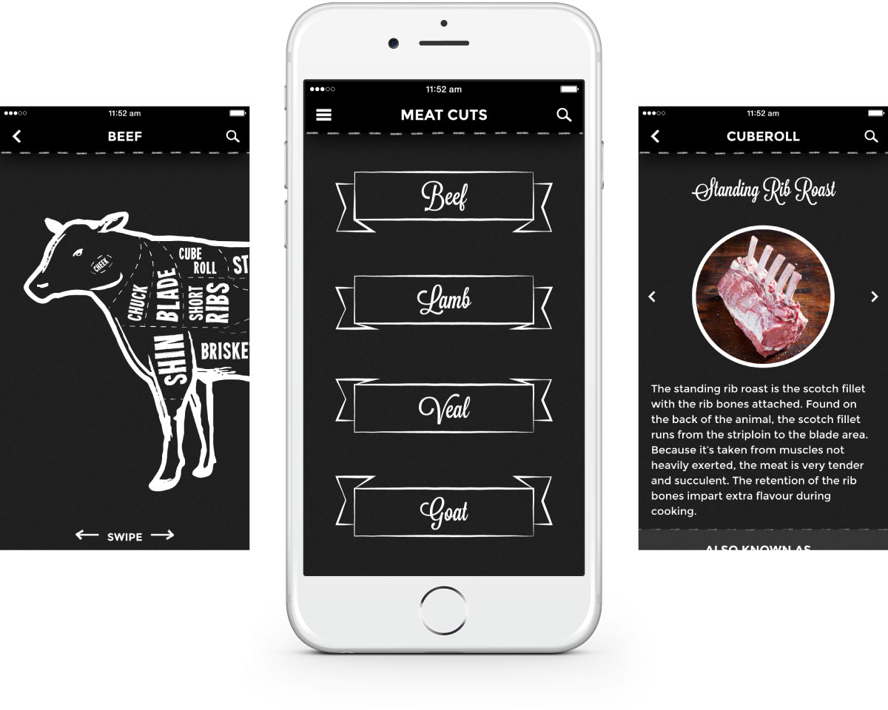

Meat Cuts is an app I worked on at <a href="http://creativelicence.com.au/" target="_blank" class="link-highlight">CLD</a>, briefed by <a href="http://www.mla.com.au/Home" target="_blank" class="link-highlight">Meat &amp; Livestock Australia</a>. They wanted to create an app for users to learn all about various cuts of meat and how best to cook them, in a fun an interactive way. Our target user group was gourmet home cooks&mdash;largely, but not exclusively, in the young male demographic.

There were a number of apps with a similar function on the App Store, so we really wanted Meat Cuts to stand out visually and to be the one that users chose.

The app has been downloaded over 60,000 times on both iOS and Android, with mostly 4 and 5 star reviews.

### My Approach

This was the first project at <a href="http://creativelicence.com.au/" target="_blank" class="link-highlight">CLD</a> where I was able to take the lead on the design and art direction, as well as being the first consumer app I really worked on. The client's only real design input was that they wanted a "chalkboard look", so I got to have a lot of fun taking ownership of both the UX/user flow and the visual design.

With feedback from my colleagues, I decided to keep both the user flow and the visuals as clean and simple as possible, while still taking care to integrate some interesting line work and imagery evocative of that chalkboard feel.

The biggest challenge I faced in the design of Meat Cuts was fitting the animal diagrams onto the small screens, while keeping them large enough for the smaller sections to be tappable. We experimented with various device-rotation ideas, but in the end decided a horizontal scroll was the most user-friendly.

Meat Cuts was built as a hybrid web app.

