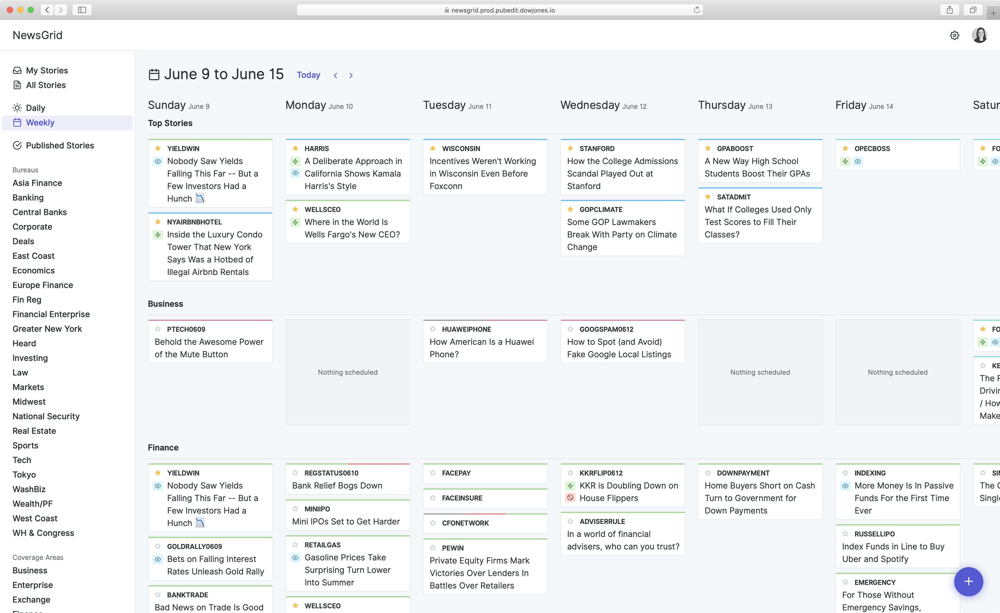

## NewsGrid

When I joined the team at WSJ, my first task was to jump on a moving train that was set out to revolutionize how news is planned for the website and the paper each day. Prior to NewsGrid, planning was done in a number of different ways around the newsroom—souped-up Google Sheets, group emails, Post-It notes, whiteboards—you name it. With a newsroom of around 1,200 people spread across dozens of global offices, this meant that news planning was essentially a big ol' mess.

Planning is important not only for the print paper, but to also make decisions for digital coverage through the day and for off-platform publishing including social media and Apple News+. The Journal publishes over 100 stories a day, a good portion of which are not breaking news—reporters can work on a story for weeks or months in advance—and so the need to plan that coverage is key.

NewsGrid allows users to create a story, to which they can attach some key dates and flags to it, along with any planned assets. They can collaborate across the newsroom in one centralized place. NewsGrid's users include reporters, editors, coverage and bureau chiefs, publishing and platform editors, podcast and video producers, and the Editor in Chief.

## Authoring

## Charts

In a business publication, charts are an essential part of the visuals presented with most articles. Charts and data are often the main thing a reader looks for in the Wall Street Journal—especially online—so having clear, readable and interactive charts is key to the newsroom. Prior to joining, the newsroom tools team had built a new charting tool that utilized [Highcharts](https://www.highcharts.com), as well as both custom data and market data. Functionally the tool was great, but it had been built scrappily, and without a designer.

## Image Manager

## News Alerts
