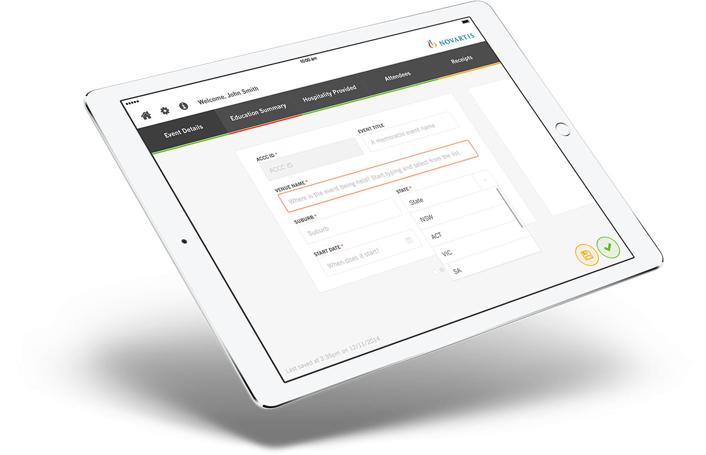

RepAssist was a pre-existing iPhone app that <a href="http://www.novartis.com/" target="_blank" class="link-highlight">Novartis</a> had, and they came to us at <a href="http://creativelicence.com.au/" target="_blank" class="link-highlight">CLD</a> asking to rebuild the thing from the ground up. The old one was&mdash;to put it delicately&mdash;in dire need of a redesign.

The app is used by sales reps for two functions; to submit expense reports for events they've held, and to order drug samples.

The app was released internally within Novartis and has received excellent reviews.

### My Approach

The UX and user flow of this app was probably one of the more complicated I've dealt with beacuse of the sheer volume of form inputs, most of which weren't super easy to split into neat categories, and the client's request to make these relatively mundane tasks "fun". We spent weeks going back and forth between layouts and ways to arrange the content before finally settling on a horizontal-swipe card layout (which, later, proved to not be the most scalable decision).

In terms of visual design, I chose to keep the interface as clean and simple as possible to balance out the content-heavy screens. I kept the colour palette largely to white and greys, only using Novartis' brand colours sparingly, always with the purpose of providing information to the user about their input in the form of error messages and buttons.

