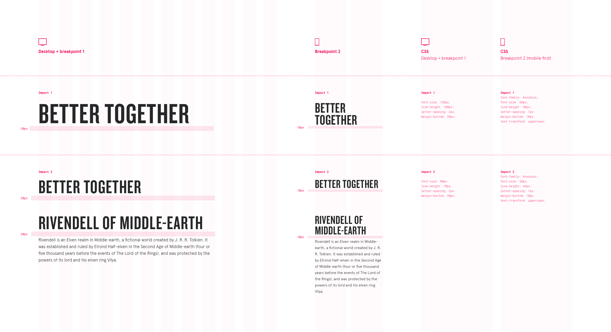
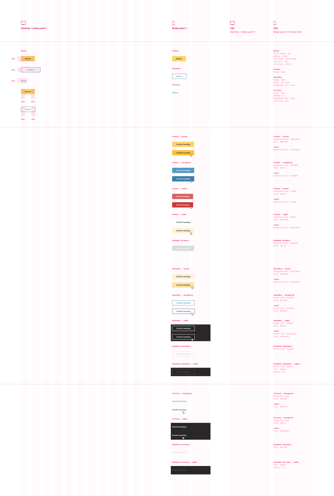
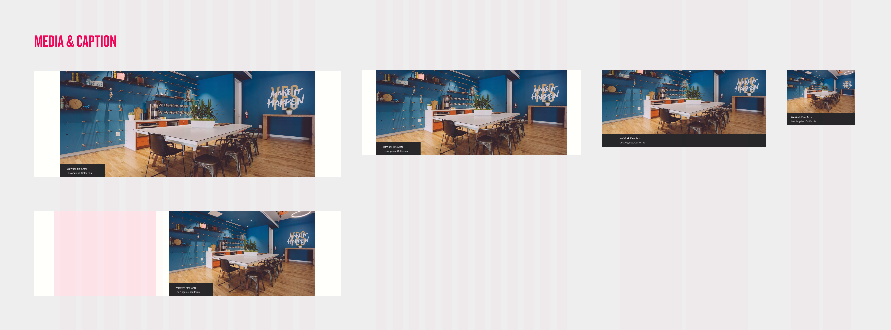
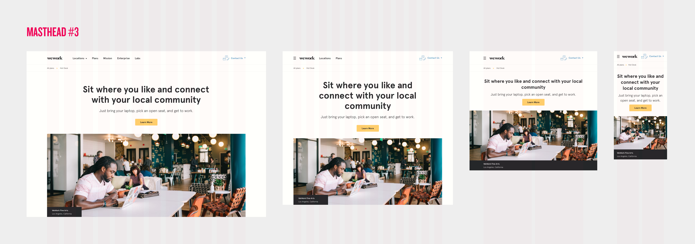
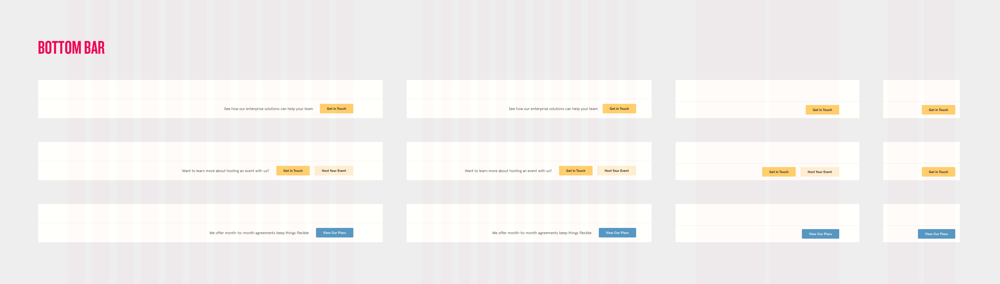
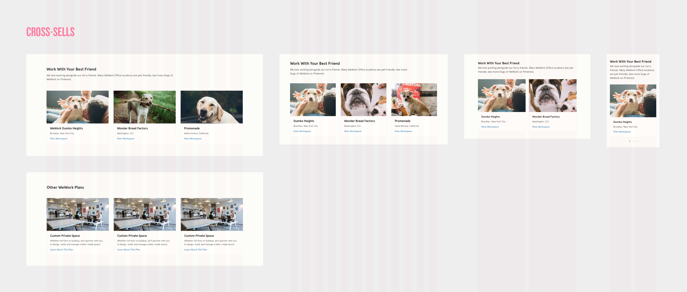

### Foundations

WeWork's <a href="http://digital-foundations.netlify.com/" target="_blank" class="link-highlight">Digital Foundations</a> seek to unify the design language across all of the company's digital properties. The evolution of these foundations for the wework.com is the <a href="http://rivendell-docs.netlify.com/" target="_blank" class="link-highlight">Rivendell</a> design system. While the foundations include elements such as color, typography, tone of voice and accessibility guidelines, Rivendell takes those to the next level with a set of reusable components and patterns.

### Patterns

Rivendell covers everything from button and input styles, to color and text style systems. These core components were then used to create reusable, but modifiable, content block patterns for the site. Based on weeks of auditing the existing site, we determined a list of roughly 20 patterns that would be used to restyle the bulk of the content on wework.com. Over the years (and incredibly fast growth), the website had definitely fallen victim to a few too many button styles and logo grids.

Visually, the goal was to create something that was rather paired back and simple, so as to give a fresh new look that we could continue to evolve and build upon. We always want to make sure the design on the digital side of WeWork reflects the beautiful, open, light-filled feel of our spaces. Color and typography are purposely used scarcely, to allow the focus to fall onto the imagery of our spaces.

The idea was that the patterns would almost be "plug and play" blocks that anyone could use to quickly and easily create a beautiful page. Creating a uniformed spacing system was key, so that the patterns could be stacked in any order and look great next to each other.

### Responsiveness and Accessibility

The patterns had to be robust, flexible and responsive. WeWork supports over 10 locales, so the patterns had to support any length of copy, and also make sense when localized (coming soon: right-to-left languages!). The patterns also had to be responsive to any viewport width or device type, as our users are split almost 50/50 across desktop and mobile, and I stressed tested the patterns vigorously to make sure all screen sizes were tended to.

With WeWork's ever-expanding audience, another high priority element of Rivendell was accessibility. We are dedicated to making sure the system is AA compliant—meaning colors were readable, inputs had labels, HTML syntax made sense, and so on.

### Prototyping

To enable rapid prototyping (and some out-of-hours design exploration), I built this <a href="http://ww-styleguide.amelia-lewis.com/style-guide" target="_blank" class="link-highlight">style guide</a> from scratch in my own environment. I also used it as a chance to <a href="http://ww-styleguide.amelia-lewis.com/" target="_blank" class="link-highlight">prototype</a> what wework.com will look like once Rivendell is fully rolled out. Actually building the patterns with HTML/CSS allowed me to further test the responsiveness of the patterns

### Integration

Over the last few months, I have led the integration and roll-out of Rivendell onto <a href="https://www.wework.com/" target="_blank" class="link-highlight">wework.com</a>. It's still a work in progress, but you can see that the core components, such as buttons, inputs and text styles, have been rolled out, and the patterns are slowly coming through too.

---

<a href="http://roomfive.net/" target="_blank" class="link-highlight">Andrew Couldwell</a> was the lead and creative director for the Rivendell design system.
