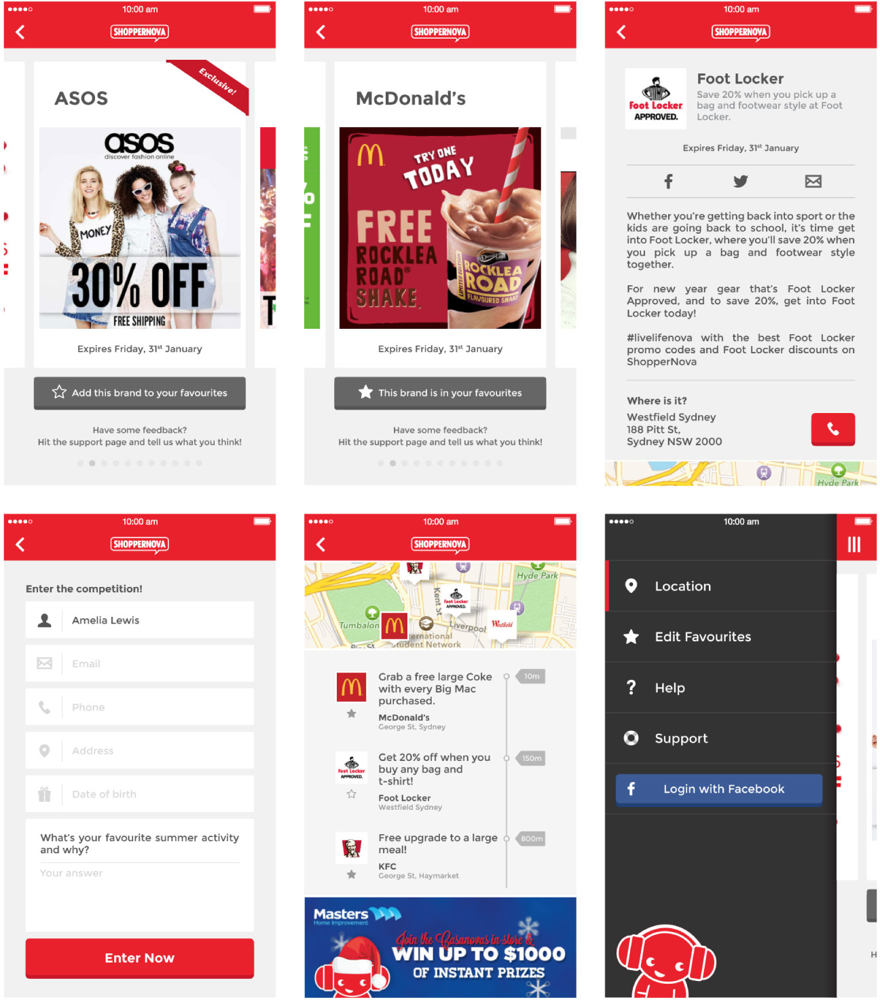

ShopperNova is a location-based deals app that <a href="http://creativelicence.com.au/" target="_blank" class="link-highlight">CLD</a> made in association with <a href="http://www.nova969.com.au/nova969/" target="_blank" class="link-highlight">Nova FM</a>&mdash;one of Sydney’s largest commercial radio stations. It was one of the first apps to utilise Passbook, and enjoyed over 100,000 downloads from the App Store. Since its conception in 2012, ShopperNova allowed Nova to seamlessly move their content into the mobile space; a necessary move for radio in this day and age.

ShopperNova took a slight turn in primary functionality (and the name, it became Play2Win), and has recently been sunsetted, but for roughly two years, I produced all the artwork for the app—often from very little in the way of assets—as well as regular email newsletters, website odds and ends, and other collateral.

The designs below never actually went into production. They were more of a passion project I did in my own time, as I was never fully satisfied with the UI design of the app.

### My Approach

I wanted to create a fresher, cleaner look for ShopperNova while keeping it mostly within the brand guidelines. Choosing Montserrat over Helvetica Neue made a world of difference in the look and feel of the app, and opting for some bolder iconography and buttons really helped the designs "pop".

I kept the user flow and screen content much the same, but decided to reorganise various sections, such as the menu, so that they made more sense and improved usability. My actual role in the project essentially allowed me to user test the app to bits over two years, so I was able to gain a lot of insight into what things worked and what didn’t.

