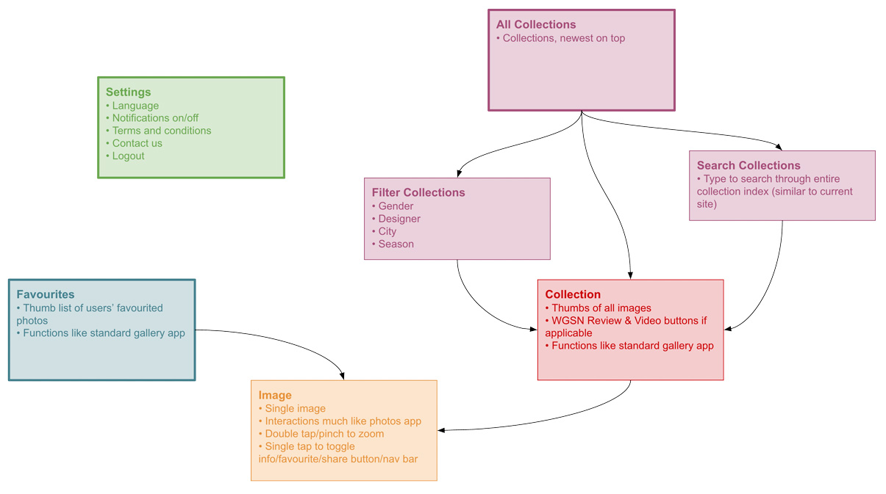
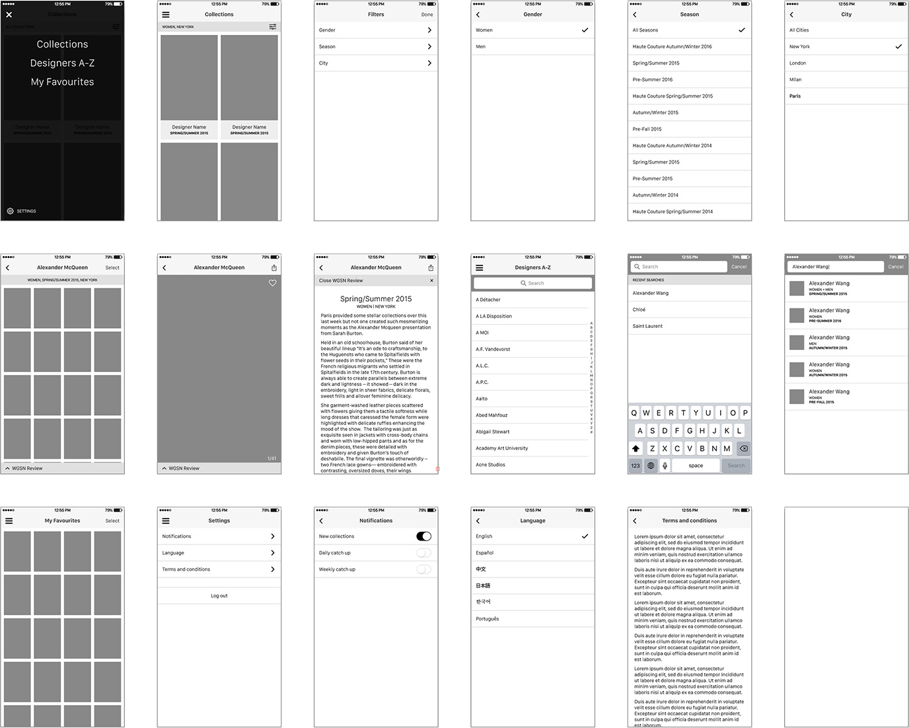

Catwalk coverage is key to <a href="http://wgsn.com/" target="_blank" class="link-highlight">WGSN</a>'s offering so extending that out into a mobile app was the obvious next step forward for our customers' Fashion Week experience. Collections from New York, London, Milan and Paris Fashion Weeks are fed through almost instantly so our users are able to stay completely up-to-the-minute with the latest looks and expert analyses.

As well as the latest shows, we wanted users to be able to search and filter through older collections, and save images to their Workspaces.

### Starting Fresh

We were starting on a clean slate for the Catwalks App, both for this app itself, and for the family of apps we knew we wanted to do after this. This meant thinking about a scalable UI and following best practices for both iOS and Android.

My role in the initial version of this project was wire framing and interaction design&mdash;deciding how the screen flow and content layout should work, as well as the interactions and transitions throughout.

For what seemed like such a simple app, some complexities arose regarding the way a user interacts with their workspace (which is not currently mobile-friendly), and the way we displayed and filtered through the collections.

Through the visual design process, I played more of backseat role, mostly providing feedback to our visual designer and helping him shape the overall look and feel of the product. We were trying to create a slightly different feel to the rest of the branding, aiming for something that felt higher-end and more exclusive. He achieved this with the darker color scheme, more use of the serif font and the full-bleed images.

The app, while only accessible to WGSN subscribers, was launched successfully in time for the January 2016 catwalk season.

### Phase Two

More recently, I started working on designs for our <a href="/projects/wgsn-city-by-city-app" class="link-highlight">City by City App</a> (CxC) as well as working on a feature update for this app, and from the beginning it was clear that we needed to define a stronger visual style guide for our apps to make them all feel like part of a family, and more like they were following iOS and Android design patterns and standards.

Aside from a number of small visual tweaks&mdash;mostly along the lines of typography and spacing&mdash;the biggest change to make in the Catwalks App was around the navigation. Originally, we had chosen to go with a hamburger menu, as that's what we do in all our web products, and it seemed the obvious choice. Upon doing more research for CxC, we came to the conclusion that a bottom tab bar was a more preferable solution for usability and scalability.

Phase 2 is still waiting to be worked on by our developers, but will hopefully be launched in time for the catwalks season.

