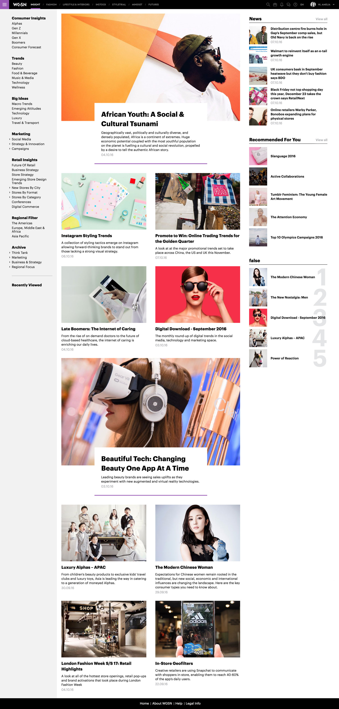
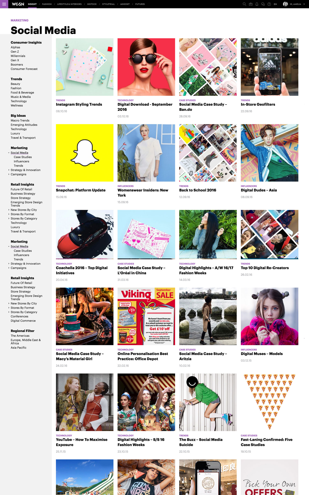
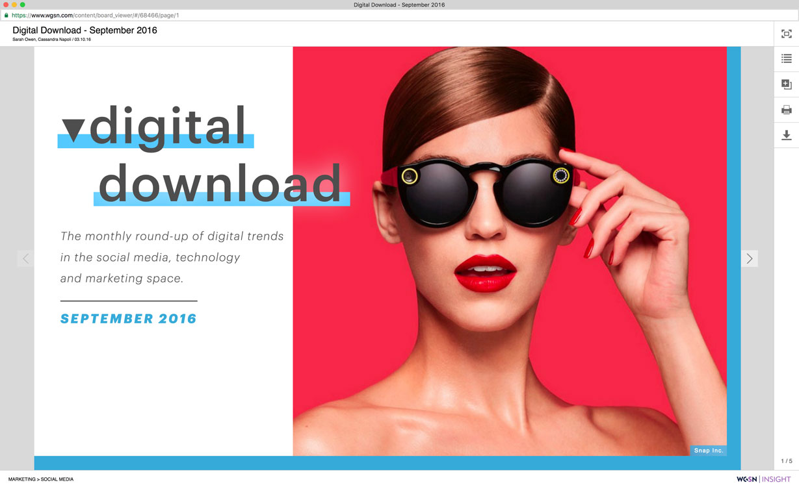
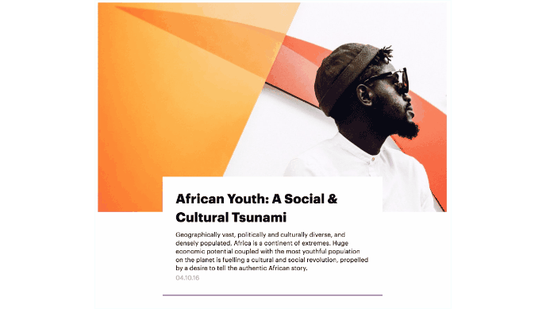

October 1st, 2016 marked the <a href="https://www.wgsn.com/en/article/wgsn-launches-wgsn-insight-consumer-market-intelligence-product/?lang=en" target="_blank" class="link-highlight">launch</a> of a brand new product for WGSN; <a href="https://www.wgsn.com/en/products/insight/" target="_blank" class="link-highlight">WGSN Insight</a>. Following the form and function of our flagship product, <a href="https://www.wgsn.com/en/products/fashion/" target="_blank" class="link-highlight">WGSN Fashion</a>,  Insight couples big-picture thinking with immediate insight into the ever-evolving consumer your brand serves, including intelligence and research on the latest technology, marketing and retail innovations.

Insight also marked the introduction of our new branding to our users; a marked step forward in the visuals and user experience of our products. It was on my suggestion that we did this. While I was not initially involved in this project, I did join closer to the end of the design phase in order to reskin the designs with the new branding, and remained heavily invovled through development to make sure the designs were executed well.

Insight was also WGSN's first responsive product. Rather than producing dozens of designs for every screen size, I created this <a href="http://wgsn-think-tank.amelia-lewis.com/" target="_blank" class="link-highlight">prototype</a> to demonstate to the developers how I wanted responsiveness to work&mdash;I always find something that moves to be far more useful in this scenario.

Another thing that was important to me with Insight (and the new branding in general), was to include little delights like fancy hover states. The interfaces, in general, are on the simpler side, so I think it's nice to show a little extra thought and care with these to "wow" our users.

The Insight launch was really <a href="https://www.wgsn.com/blogs/5-reasons-why-you-will-love-wgsn-insight/" target="_blank" class="link-highlight">successful</a>, from both a product/tech standpoint and also a sales one. Anticipation of the launch drove sales to record highs and we had almost no tech hiccups during, or post-launch. By all accounts, our users are absolutely loving the product.
