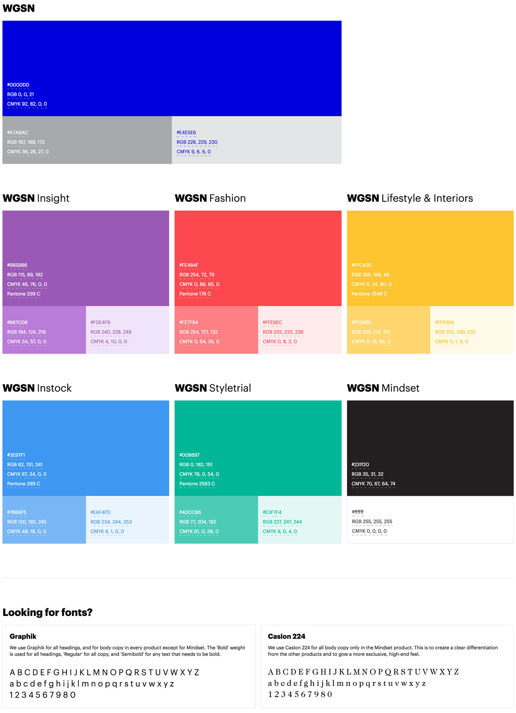
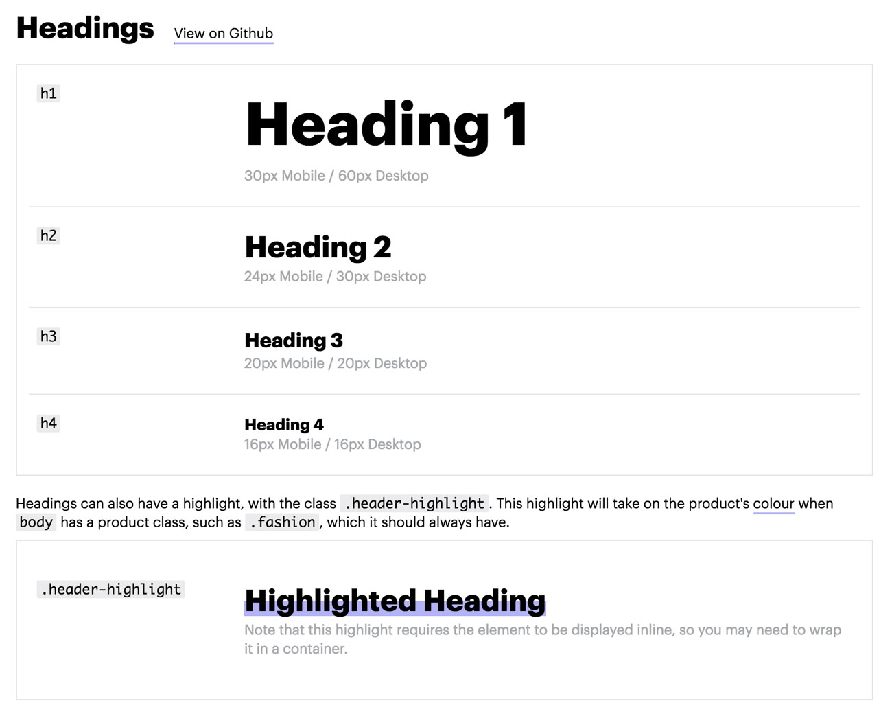
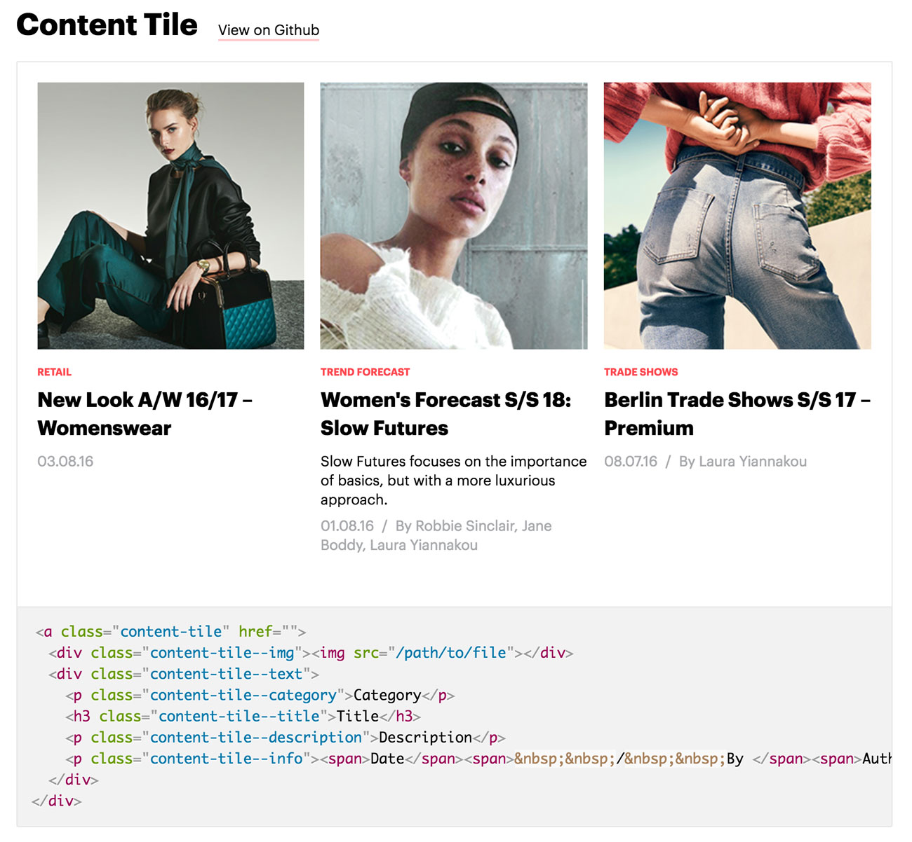
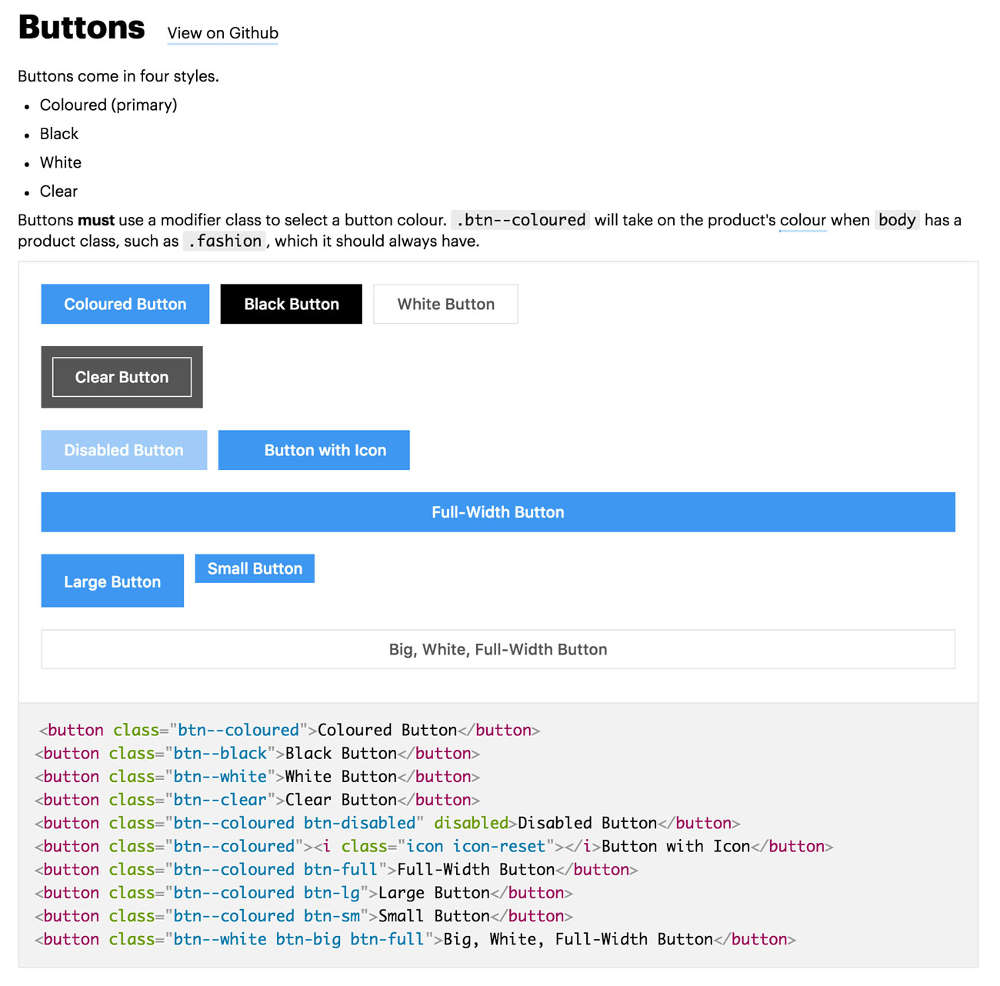
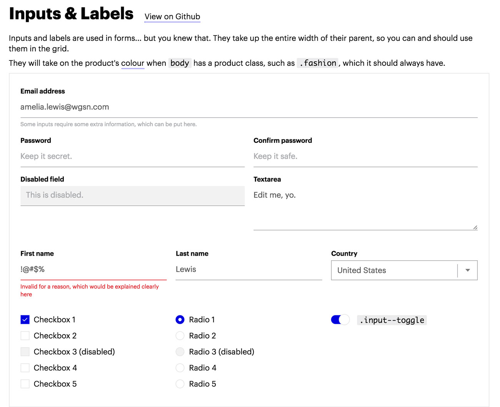
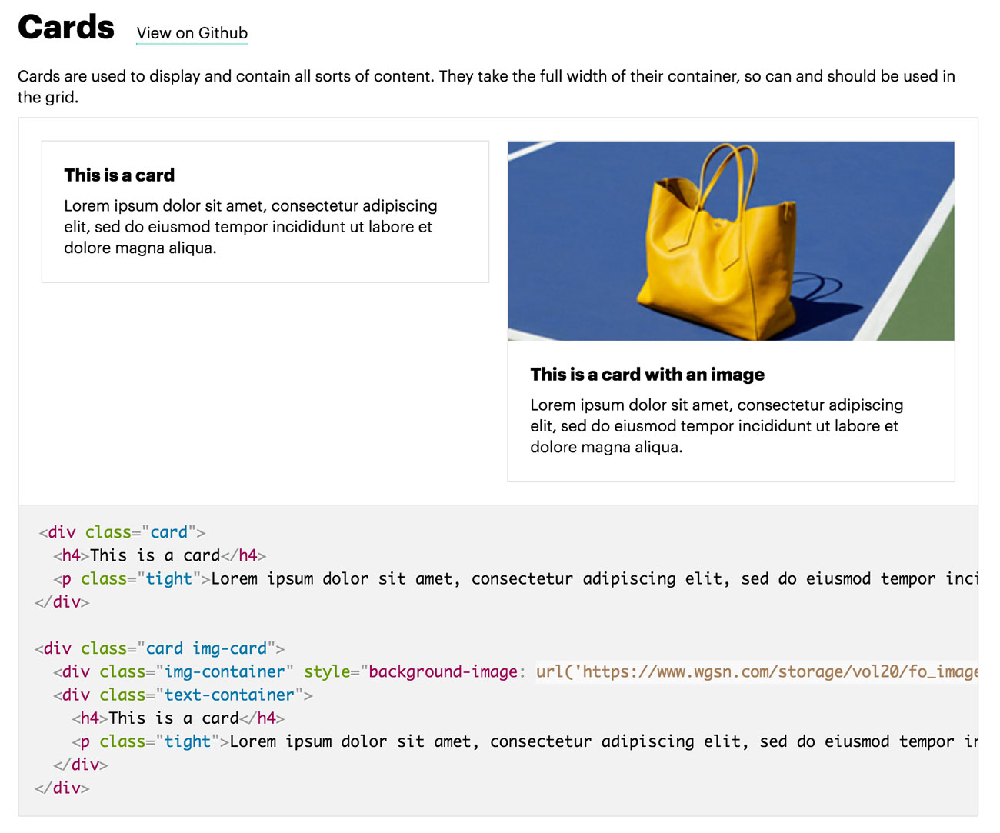
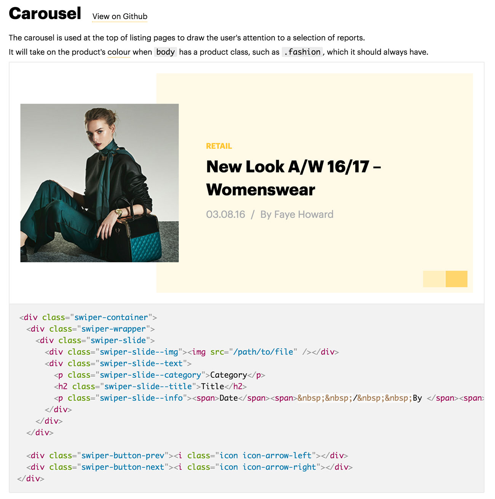

The WGSN style guide began as a simple tool for myself from which to grab the colors and logos for all our products. After a few months at WGSN, however, it became apparent there was no solid structure or style guide for how we were designing our products. Every UI element was being designed and coded over and over... always slightly differently. So, I took it upon myself to start creating a full style guide for the WGSN product team. The company also began a big rebrand project around this time, putting us in the perfect position to think about redesigning every UI element.

*Color system tool*

Taking inspiration from sites like Dropbox's [Scooter](http://dropbox.github.io/scooter/index.html) and Marvel's [Style Guide](https://marvelapp.com/styleguide/overview/introduction), I started compiling a full set of UI components and styles used around the site and constructed them into guidelines and reusable components.

I worked on the style guide alongside designing an actual product&mdash;which proved to be very useful, for both things&mdash;and created all these elements, or "building blocks", which we could use from then on to design all our products. It was important that these elements were reusable across different screens, platforms and contexts.

*Text styles*

*Content tile*

*Buttons*

*Inputs*

*Cards*

*Carousel*

This project is as much about front-end development as it is design. A very important part of this is setting standards for the CSS we write as a team, and consolidating all the components that we've historically written over and over again. Through the entire preocess, I've been working closely with the front-end developers to ensure everything I'm making works well for them and their code bases. Similarly, I've made sure to closely involve our creative services teams to make sure our products are tied in nicely with any marketing collateral our users see.
