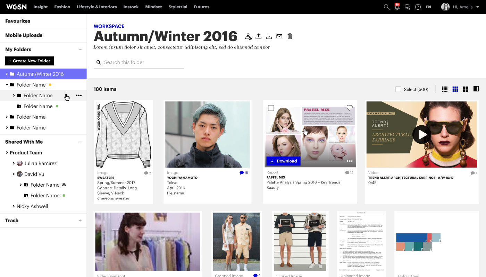
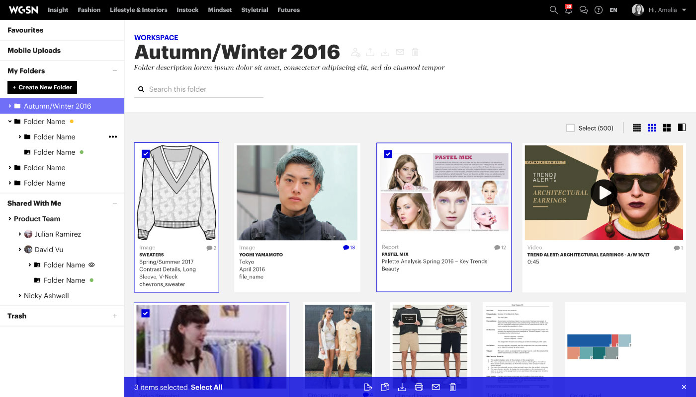
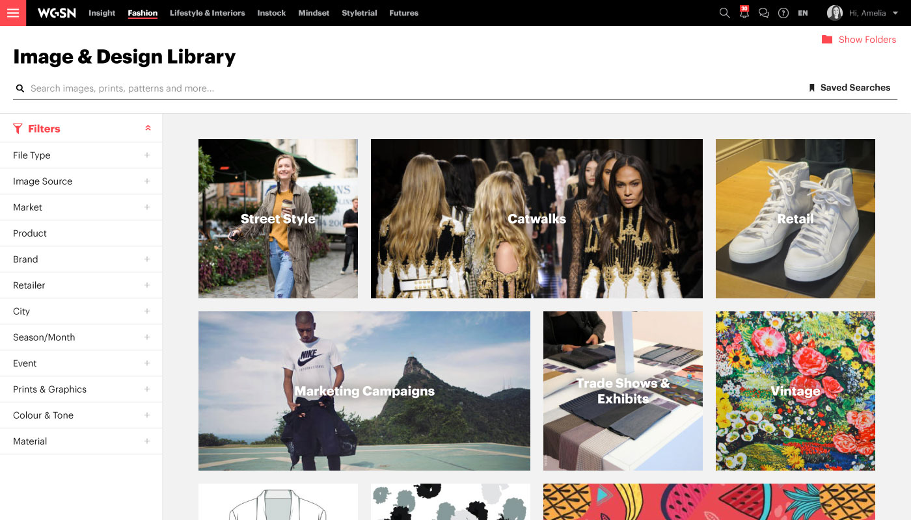
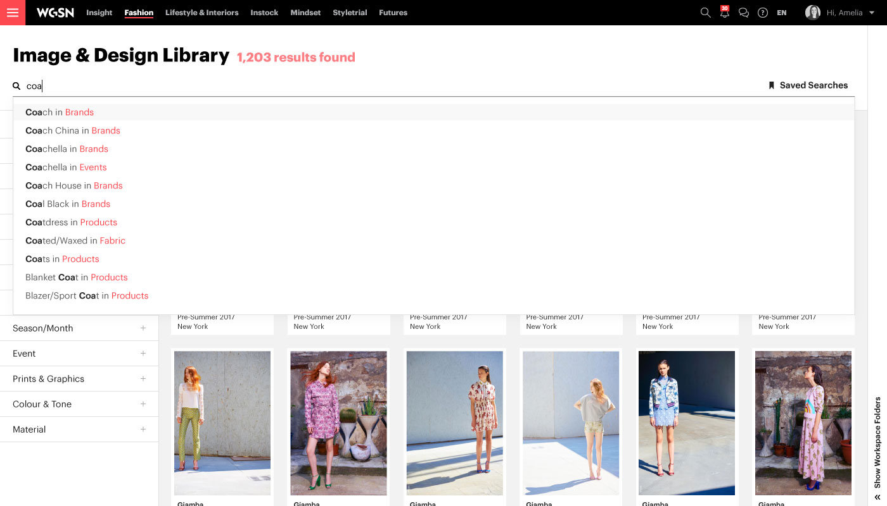
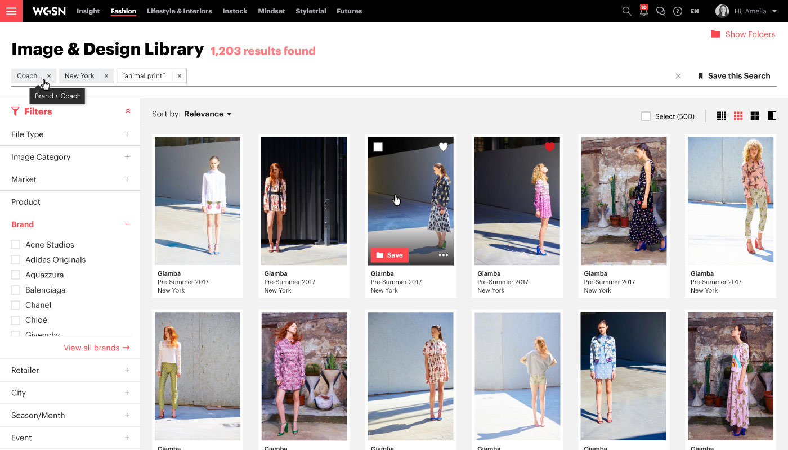
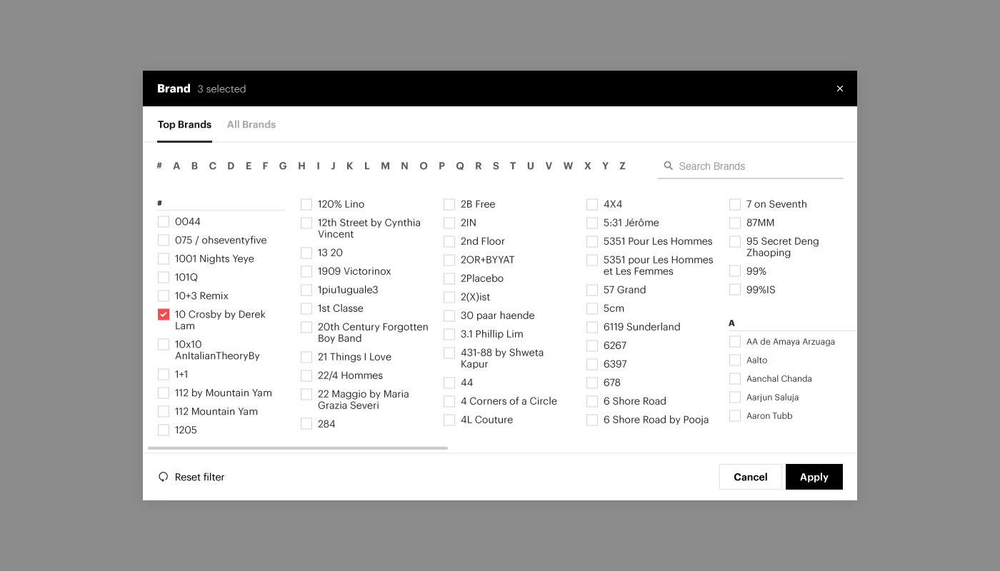
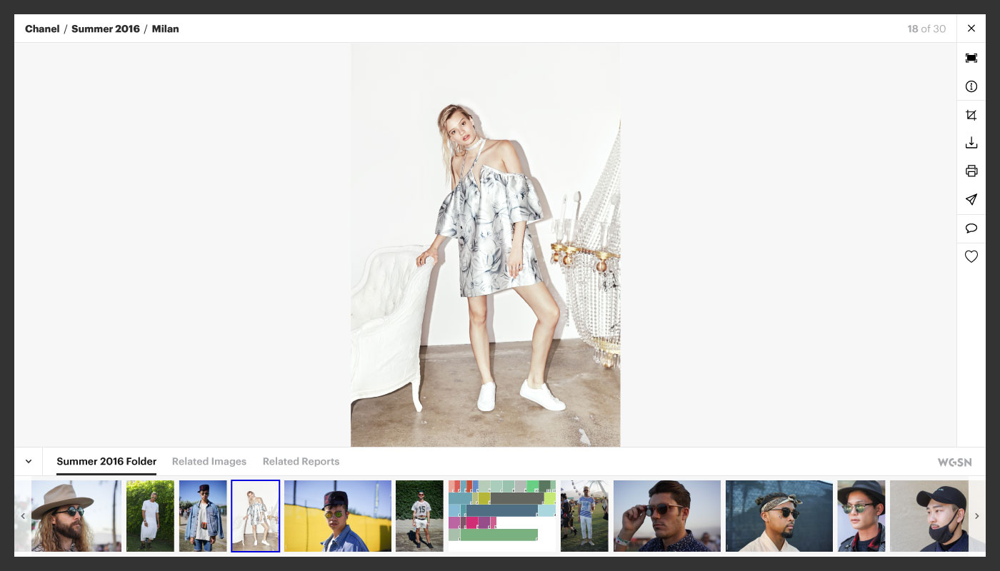
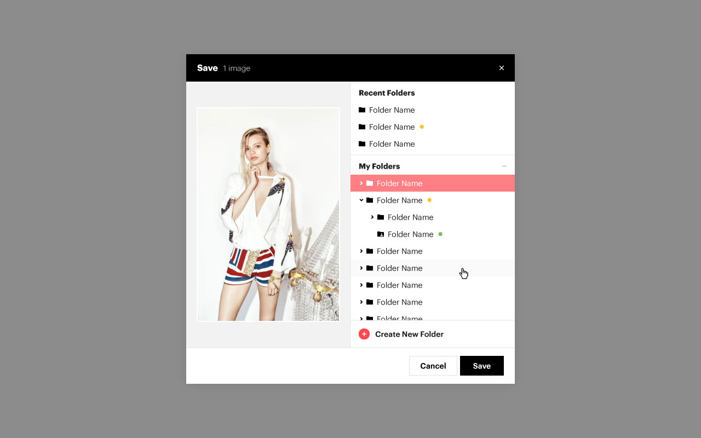
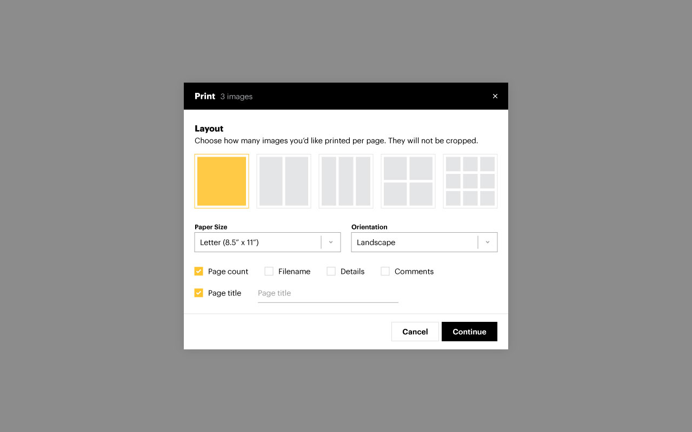

WGSN's Image & Design Library is where subscribers can access our database of over 20 million exclusive images and design resources. Workspace is where they can save and organize all their favorite content from sections of the site including Image & Design Library, often a core part of their workflow. Both of these products have been untouched for around 8 years, and at the beginning of 2016 we begun the process of a full redesign and rebuild.

Full case study coming soon.

