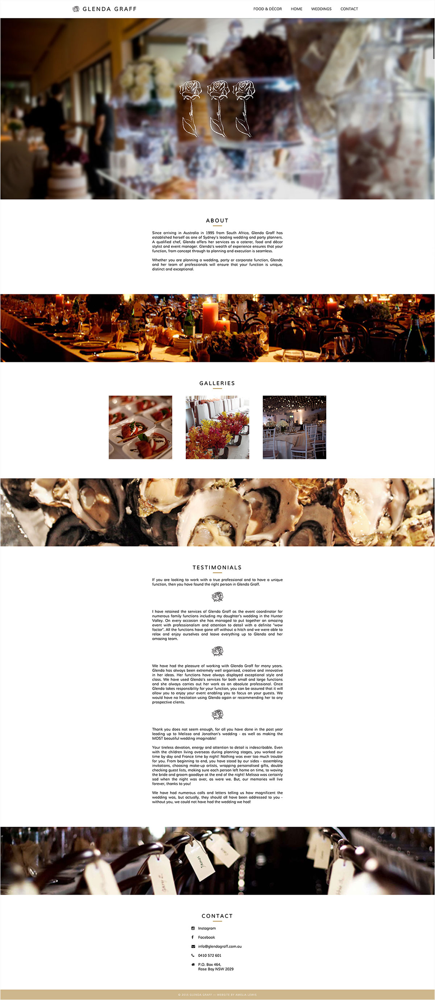

Glenda Graff is an exclusive wedding and event planner based in Sydney's eastern suburbs. She caters to high end clients and needed a website that reflected the aesthetic of her events and was able to showcase large amounts of imagery.

Since Glenda is a friend, this has been a great project for me to learn and grow over the last few years. Glenda has been happy for me to take creative control and the site has functioned largely as a passion project for me where I have been able to iterate the design and make it better as I've gotten better. 

### My Approach

At the beginning of the project, I was given a logo, a color and a small mountain of images. Together we developed some content for the site and I set out to create a great design. The first iteration was certainly not the sexiest website in the world, but over time the design has evolved into something sleek and modern, showcasing lots of beautiful imagery.

I built the website from scratch, using <a href="http://wintersmith.io/" target="_blank" class="link-highlight">Wintersmith</a>.

Next time I work on this project, I would like to work out a better way of loading images, as well as connecting a CMS so the client can upload imagery. There is also potential to expand the content out and include things like booking forms and more detailed service information.

