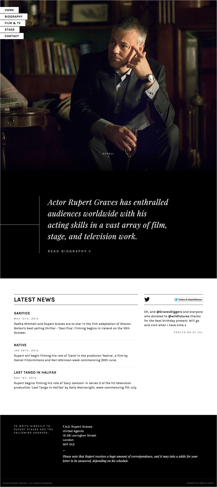

### About the Project

This is—well, will be—the official website for UK actor, Rupert Graves. His <a href="http://rupert-graves.com/" class="highlighted" target="_blank">current site</a> is rather dated, so we’ve been working to create something a little sexier and more modern.

### My Approach

This is still very much a work in progress. I’ve been through a few iterations but I’m yet to settle on something that I love. It’s been interesting researching similar sites, and trying to decide what content is actually worth having on here as opposed to what’s available elsewhere on the web.

I’m essentially creating a visual brand for Rupert, so I want it to be something that stands out and looks great.

