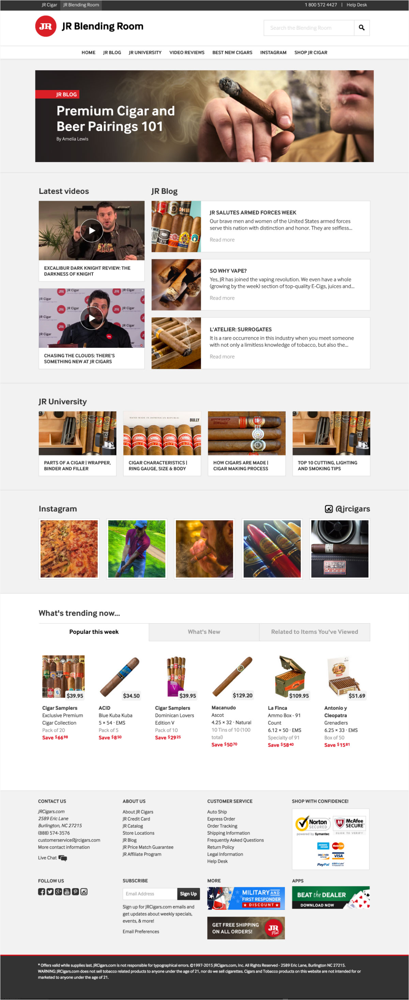

### About

JR Cigars is the world's largest cigar e-commerce site, and <a href="http://creativelicence.com.au/" target="_blank" class="highlighted">CLD</a> recently redesigned and rebuilt their platform. While I didn't play a huge role in the site design, I did do a number of feature updates and changes.

The Blending Room is a new content hub for JR's customers to get access to everything they need to know about cigars, latest news and events, video reviews and intgrated social media feeds. This type of content experiences very high traffic on the current site and is great for SEO, so The Blending Room was conceived as a way to really consolidate all that content in its own, dedicated place and enrich the user experience.

The Blending Room is a Wordpress site.

### My Approach

I was brought onto this project as design lead well into the content and basic layout decisions, but was essentially given free reign to make the space as interesting and exciting as possible. While remaining within the JR branding, I was able to make The Blending Room a little more fun and "edgier" than the very conservative look and feel of the e-commerce site.

To make the experience as rich and exciting as possible, I kept the design very image centric. This allowed the client and their editorial team to support their content with great assets.

This was the first time I'd even touched Wordpress, and while at first I was somewhat daunted, once I got my head around it all it was actually quite a smooth process. I was, however, largely working with already existing CSS styles and templates from the main site.

