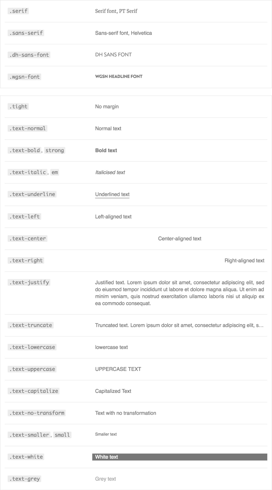

<h3 data-title="What is it?">What is it?</h3>

This brand guide started as a simple tool for myself. I kept finding myself needing the colors and logos for all our products, so I built a simple site to copy and download them from (now, the <a href="http://wgsn-styleguide.amelia-lewis.com/" target="_blank" class="highlighted">products</a> page of the site). It quickly spread around the company, and everyone from creative services to sales loved it.

As time went on, it became apparent there was no solid structure or style guide for how we were designing our products. Every UI element was being designed and coded over and over... always slightly differently. So, I took it upon myself to make a full style guide / pattern library. Taking inspiration from places like Dropbox's <a href="http://dropbox.github.io/scooter/index.html" target="_blank" class="highlighted">Scooter</a> and Marvel's <a href="https://marvelapp.com/styleguide/overview/introduction" target="_blank" class="highlighted">Style Guide</a>, I started compiling UI elements from the most recent projects we'd worked on and constructing the site.

This is still a work in progress in terms of making it something robust and usable for the developers, but we are working together to find a way to integrate it into their code stack and their workflow.

