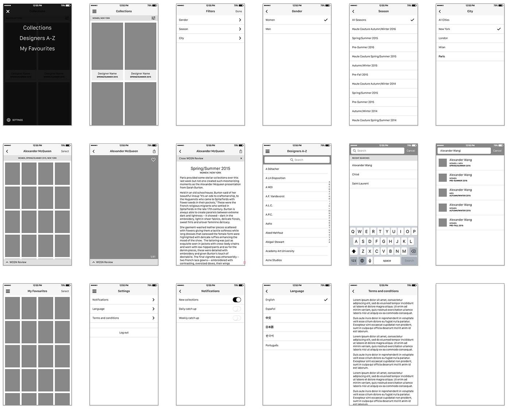
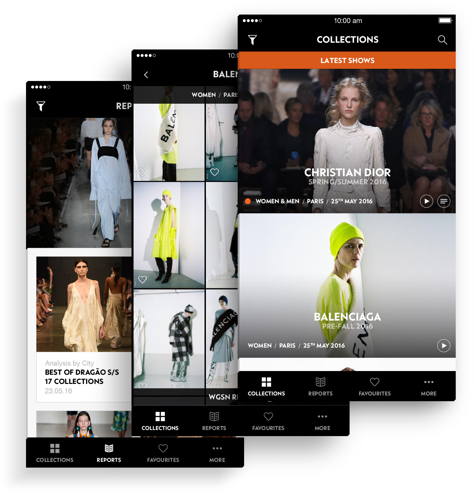

<h3 data-title="What is it?">What is it?</h3>

A key part of <a href="http://wgsn.com/" target="_blank" class="highlighted">WGSN</a>'s content is runway coverage from fashion week and other events, so it only made sense to make this even more available to our clients by bringing it straight to them in an app. The content is very simple&mdash;a feed of fashion shows, each with a collection of images and some with a review from one of the editors.

<h3 data-title="The Design Process">The Design Process</h3>

My role in the initial version of this project was wire framing and interaction design, working with the visual designer on our team. The app's core function is to display a feed of fashion shows, along with some added features like filtering the collections, the ability to favourite images and push notifications.

The main UX challenge was deciding how to display the latest collections versus the entire archive, and whether that distinction even made sense. Beyond that, we followed standard patterns for displaying images within an album, with the addition of simple filtering like you'd see in any e-commerce product.

Through the visual design process, I played more of backseat role, mostly providing feedback to our visual designer and helping him shape the overall look and feel of the product. We were trying to create a slightly different feel to the rest of the branding, aiming for something that felt higher-end and more exclusive. This was achieved by the darker color scheme, more use of the serif font and the full-bleed images.

The app&mdash;while only available to WGSN-subscribers&mdash;was launched successfully prior to the January 2016 catwalk season.

<h3 data-title="Phase 2">Phase 2</h3>

More recently, I started working on designs for our <a href="/projects/wgsn-city-by-city-app" class="highlighted">City by City App</a> (CxC) as well as working on a feature update for this app, and from the beginning it was clear that we needed to define a stronger visual style guide for our apps to make them all feel like part of a family.

Aside from a number of small visual tweaks&mdash;mostly along the lines of typography and spacing&mdash;the biggest change to make in the Catwalks App was around the navigation. Originally, we had chosen to go with a hamburger menu, as that's what we do in all our web products, and it seemed the obvious choice. Upon doing more research for CxC, we came to the conclusion that a bottom tab bar was a more preferable solution for usability and scalability. With the bottom bar, we could uniform our app structures (and better follow Apple's design guidelines).

Phase 2 is still waiting to be worked on by our engineers, but will hopefully be launched by the end of the year.

