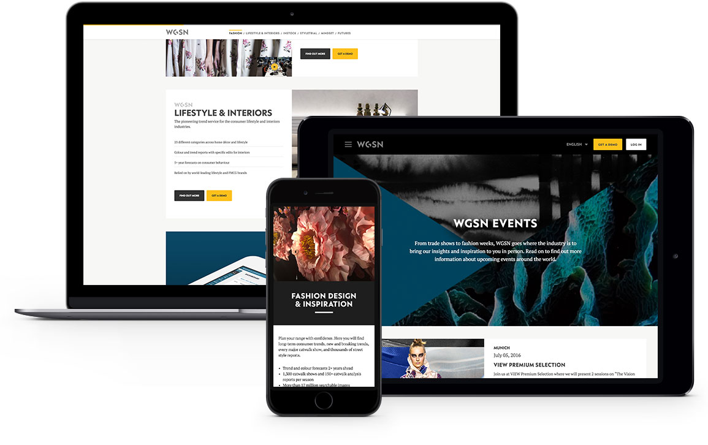

### About

When I started at <a href="http://wgsn.com/" target="_blank" class="link-highlight">WGSN</a>, the product and marketing teams were already well into the redesign of their non-subscriber site. The goal was to refresh the look of the site and pull together the various product sites under the new "single platform" approach.

Flat designs for the desktop version of the site were done, and my task was to turn these into responsive designs that could work across all screens and devices.

### Making a Desktop Site Responsive

The existing designs had been done for a larger desktop screen, so various elements had to be adjusted in order to make them more modular and able be to transformed between all different screen sizes. I really wanted the site to be completely fluid, not just fixed to a handful of breakpoints. Some elements made for easy, obvious transitions, while others had to be tweaked on the larger screens in order to make for a smarter transition into the smaller screens.

Even though this was a marketing/brochure site, I still wanted there to be a strongly held design system in place. This site redesign marked the beginning of a new look and feel for all our other WGSN products and it was important to put a strong foot forward.

### Prototyping

In order to most effectively communicate how I wanted the site to behave between different screen sizes, I put together a <a href="http://wgsn-public-site.amelia-lewis.com/" target="_blank" class="link-highlight">prototype</a>. This was built from scratch using <a href="https://harpjs.com/" target="_blank" class="link-highlight">Harp</a> and ended up being rather high-fidelity as a I had a lot of time to work on it.

The prototype proved to be very useful, as we were working with developers overseas to build the site, so it was a great way to get the point across to them. It also proved very useful for the art department to try out different imagery easily before having the proper site and CMS built.