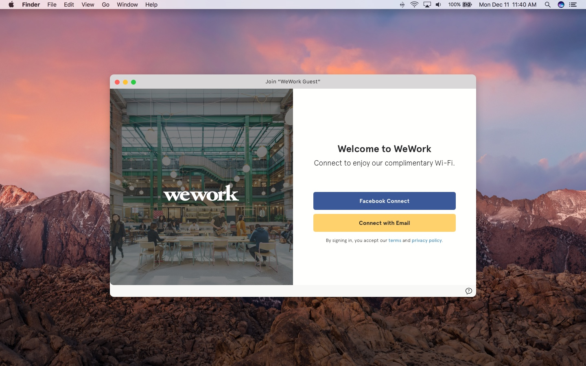
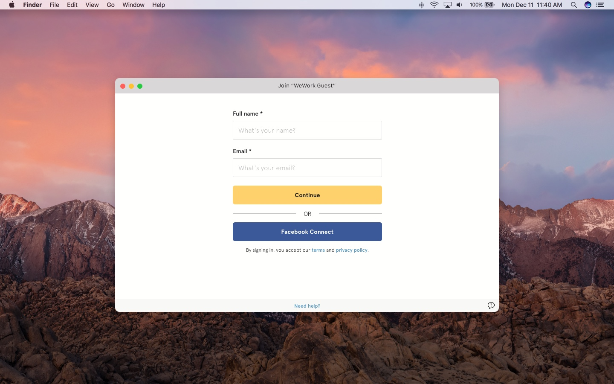
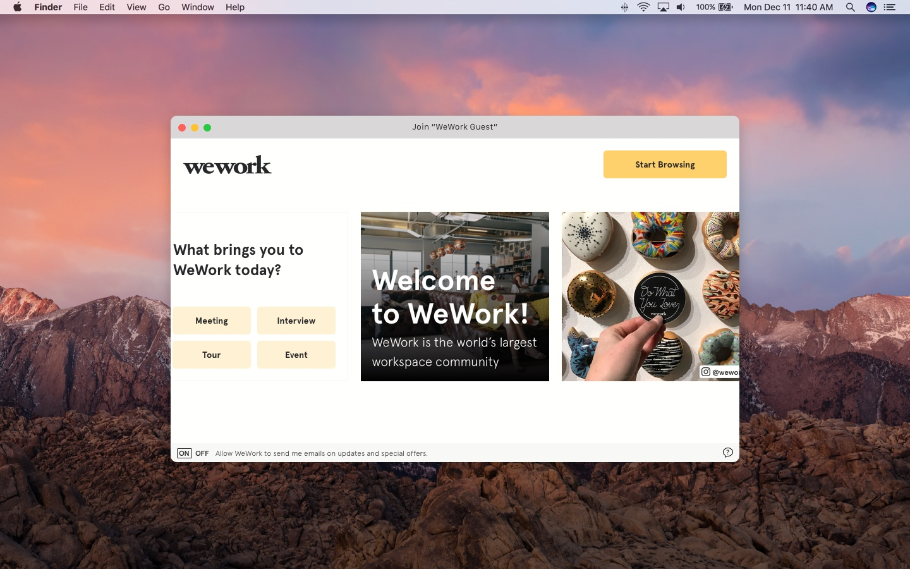
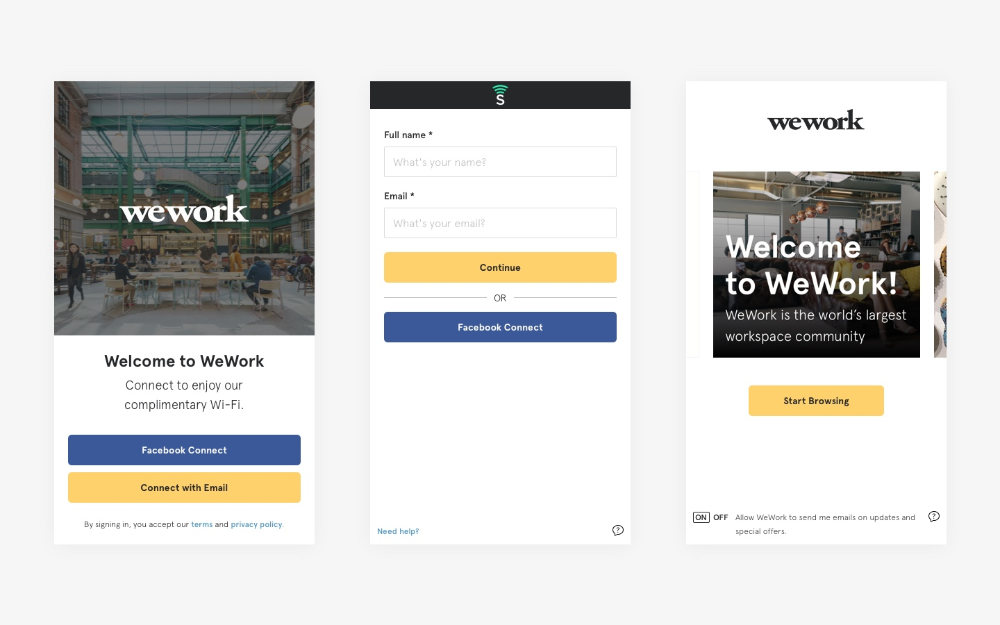

In late-2017, WeWork's marketing team was presented with a great opportunity to set up guest wi-fi in all locations. The was beneficial both for the user, to help them learn more about WeWork (and get wi-fi), but also for the business to acquire leads.

I worked closely with internal stakeholders and with the team at <a href="https://www.socialsign.in/" target="_blank" class="link-highlight">SocialSign.in</a> to design the look and feel of the flow, and then I wrote the CSS to integrate the styles. The design of the experience obviously had to be optimized for both mobile and desktop, as there are any number of reasons—work-related or not—that somoene may be in a WeWork. The guest wi-fi also, for the first time ever, gives WeWork an opportunity to find out more about these reasons. For a user who may be less familiar with the brand, we've put in some handy information for how to interact with the space and learn more.

We are rolling out the experience globally, adding new languages and locales every month. Thus far we have launched in the US, Canada, Latin America and Europe. The launch so far has been considered extremely successful. In just the first month-and-a-half, over 50,000 users logged into the guest wi-fi, and 82% of those people were new leads. To date, gated wi-fi has contributed to over 500 desks sold.

